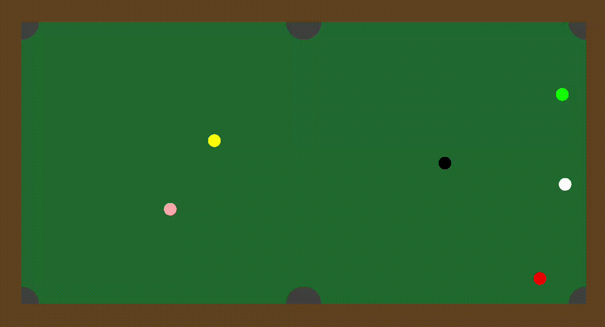

# Pocketball Simulator
SSAFY 내 일타싸피 대회를 대비하기 위해 만든 시뮬레이터입니다.



실제 대회에서는 코드를 `main()`에 전부 작성하고  `power`와 `angle` 변수를 서버에 메시지로 보내는 방식으로 되어있고, 각도도 이 시뮬레이터와 달리 270도? 돌려야 합니다. 
또한 실제 사용하는 클라이언트는 이 시뮬레이터와 물리 상수들에 차이가 있고, 무엇보다 각 홀 주변의 생김새가 달라 이 시뮬레이터보다 넣기 어렵습니다. 이 시뮬레이터는 대회를 준비하기 위한 보조 도구 정도로만 사용하도록 합시다. 


## 1. 패키지
사실 구성 요소들 사이의 의존 문제가 여전히 남아있지만, 전체적으로는 MVC 패턴을 따르는 방식으로 만들었습니다. 
처음에 만들 땐 패키지를 따로 구분하지 않고 모든 파일을 디폴트 패키지에 넣어 놨고, 클래스 필드의 접근제한자도 모두 `default`를 썼지만, 이번에 수정하면서 패키지도 구분하고 접근제한자도 수정했습니다.

### `model`
`model` 패키지에는 우선, 당구공에 해당하는 `Ball` 클래스가 있습니다. 내부에는 공의 현 위치, 다음 위치, 속력, 유효 여부, 색 등등의 필드가 있고, 부딪히고 튕기는 등의 물리를 구현한 메서드 등의 여러 메서드가 있습니다.
`Vector` 클래스는 이 공의 움직임 및 충돌 계산을 위해 필요한 2차원 벡터에 해당하는 클래스로, 단위 벡터, 내적, 크기를 구하는 등의 메서드들이 있습니다. 
게임 내 여러 상수값들을 넣어 놓은 `Constant` 클래스도 있습니다.

### `controller`
`controller` 패키지에는 게임의 상태 및 로직을 처리하는 `Game` 클래스가 있습니다.  

### `view`
`view` 패키지에는 자바 swiong으로 게임 화면을 그리는 `Display` 클래스가 있습니다.


## 2. 사용법
코드를 테스트하려면 `player.Player`의 `getAngle()`, `getPower()` 메서드를 수정하면 됩니다. `Player` 클래스의 `balls`에는 현재 공들의 위치가 들어가 있으니 해당 정보를 활용합시다.

```java
public class Player {
	//이 플레이어의 순서
	private int order;

	//공의 위치. 첫 번째가 흰 공, 마지막이 검은 공이다. 
	//balls[i][0]이 x, balls[i][1]이 y다. 
	//포켓된 공의 좌표는 (0, 0)으로 바뀐다.
	private double[][] balls;

	public double getAngle();
	public double getPower();
}
```

`getAngle()`과 `getPower()`가 적당한 값들을 반환하도록 작성했다면, `Main.main()`을 실행해 프로그램을 실행합니다. 실행 시 아래의 메시지가 터미널에 나타난며, 플레이어의 수와 플레이어 별 공 수(수구와 마지막 공을 제외)를 입력하면 GUI와 함께 게임이 시작됩니다.

```
플레이어 수(최대 2), 플레이어 별 공 수(최대 2)를 빈 칸 하나를 두고 입력해주세요.
```


